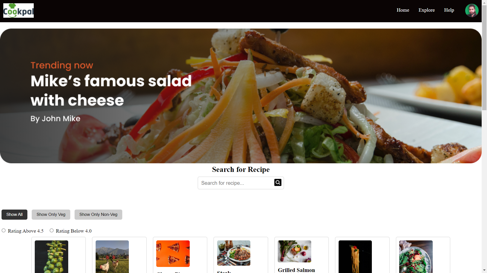

<div align="center">
  <h2 align="center">Recipe - F2 Contest 2</h2>

 An interactive recipe catalogue. The catalogue should allow users to view recipes from a predefined array and provide several interactive filtering and sorting options.

  <a href="https://vishalp-08.github.io/blinkit_clone_HTML_CSS/"><strong>➥ Live Demo</strong></a>

</div>

<br />

### Demo Screeshots



### Prerequisites

Before you begin, ensure you have met the following requirements:

* [Git](https://git-scm.com/downloads "Download Git") must be installed on your operating system.

### Run Locally

To run **Recipe** locally, run this command on your git bash:

Linux and macOS:

```bash
sudo git clone https://vishalp-08.github.io/blinkit_clone_HTML_CSS/
```

Windows:

```bash
git clone https://vishalp-08.github.io/blinkit_clone_HTML_CSS/
```

### Contact

If you want to contact with me you can reach me at [WhatsApp](https://wa.me/917992199075).

